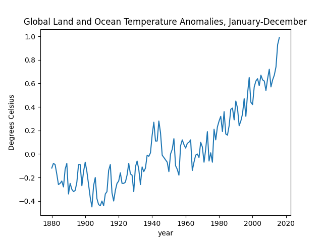

# Environmental-data
#Project_02

##Introduction

for this project, I decided to inspect the data for the population of China and the United States over the years, the emissions per capita of these two crounties, and the global land and ocean temperature anomalies

## Data

The following graphs and charts illustrate the data for the topics listeed above

### Population fo China and the United States

### Emmissions per capita

### Global land and ocean temperature anomalies

