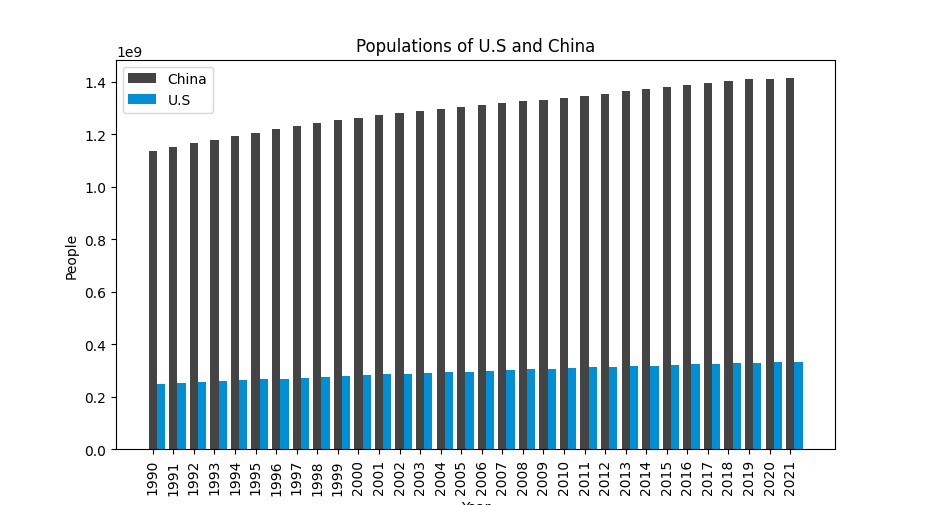
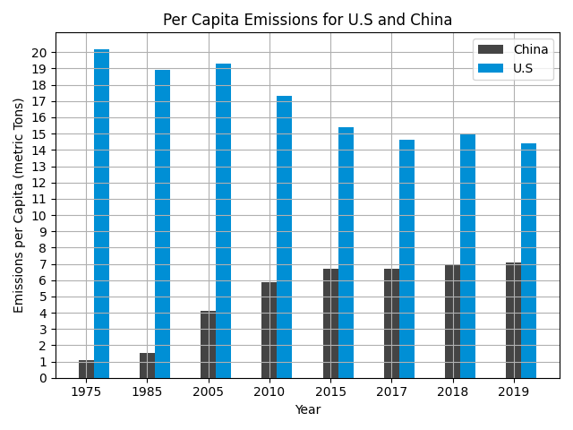

# Environmental-data

## Introduction

for this project, I decided to inspect the data for the population of China and the United States over the years, the emissions per capita of these two crounties, and the global land and ocean temperature anomalies. 

This project tis part for my CS 40 class. You can find the instructions for the project [here](https://github.com/mikeizbicki/cmc-csci040/tree/2022fall/project_02)

## Data

The following graphs and charts illustrate the data for the topics listeed above

## Population fo China and the United States

This data the population since 1990 for the U.S and China, the two countries with the highest GDP. 

This data was obtained the worldbank. Here is the access for the [U.S](https://data.worldbank.org/indicator/SP.POP.TOTL?locations=US) and [China](https://data.worldbank.org/indicator/SP.POP.TOTL?locations=CN)

## Emmissions per capita

Bar chart shows the per capita emmisons for the U.S and China Data for 1975, 1995, 2005, 2010, 2015, 2017, 2018, 2019. This was personally my favorite chart, not only bacuase I spent **A LOT** of time on it, but also becuase it makes me optimistic that we can reduce our per capita emissions (even if this progrss has to come a little bit faster). 

Data from [United Nations Statistics Division](http://data.un.org/)

## Global land and ocean temperature anomalies

This graph shows the temperature anomalies from 1880 to 2016. These anomalies are calculated by subtracting a baseline number from the average temperature that year. The baseline number is normally calculated by avaraging the temperature of 30 or more previous years. So... things are getting toasty. 

This data was obtained from NCEI and NOAA [here](https://www.ncei.noaa.gov/access/monitoring/climate-at-a-glance/global/time-series/globe/)